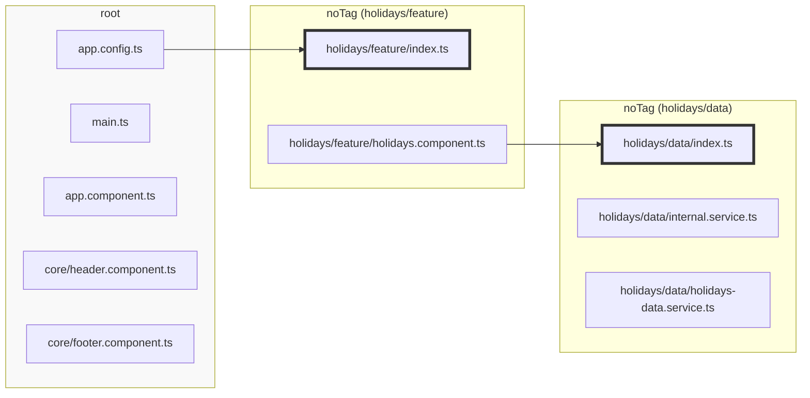
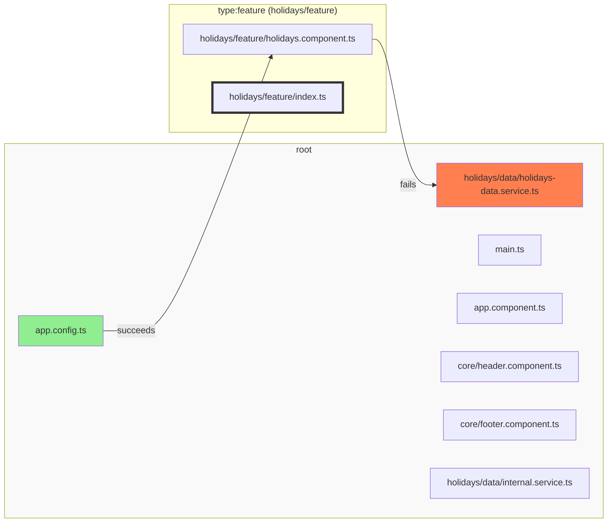
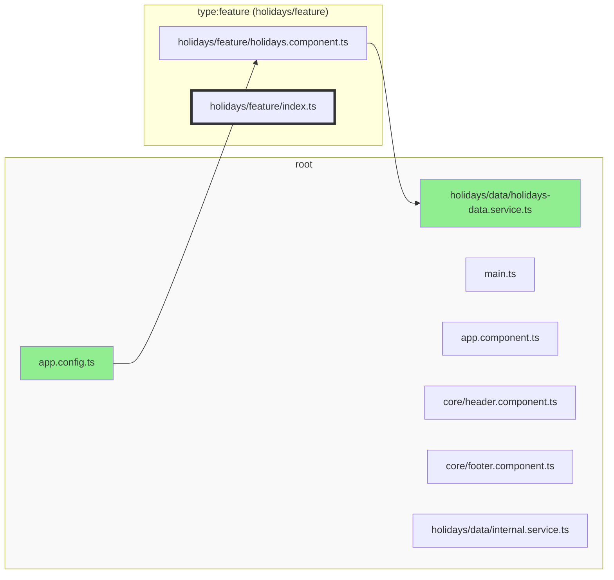

# Sheriff

Modularity for TypeScript Projects


[](https://www.npmjs.com/package/%40softarc%2Fsheriff-core)

<p align="center">

</p>

Sheriff enforces module boundaries and dependency rules in TypeScript.

It is easy to use and has **zero dependencies**. The only peer dependency is TypeScript itself.

Some examples are located in _./test-projects/_.

<!-- TOC -->

- [1. Installation \& Setup](#1-installation--setup)
  - [1.1. Sheriff and ESLint (recommended)](#11-sheriff-and-eslint-recommended)
  - [1.2. Sheriff without ESLint](#12-sheriff-without-eslint)
- [2. Video Introduction](#2-video-introduction)
- [3. Module Boundaries](#3-module-boundaries)
- [4. Dependency Rules](#4-dependency-rules)
  - [4.1. Automatic Tagging](#41-automatic-tagging)
  - [4.2. The `root` Tag](#42-the-root-tag)
  - [4.3. Manual Tagging](#43-manual-tagging)
  - [4.4. Nested Paths](#44-nested-paths)
  - [4.5. Placeholders](#45-placeholders)
  - [4.6. `depRules` Functions \& Wildcards](#46-deprules-functions--wildcards)
- [5. CLI](#5-cli)
  - [5.1. init](#51-init)
  - [5.2. verify \[main.ts\]](#52-verify-maints)
  - [5.3. list \[main.ts\]](#53-list-maints)
  - [5.4. export \[main.ts\]](#54-export-maints)
- [6. Integrating Sheriff into large Projects via `excludeRoot`](#6-integrating-sheriff-into-large-projects-via-excluderoot)
- [7. Planned Features](#7-planned-features)

<!-- TOC -->

## 1. Installation & Setup

Examples are available at https://github.com/softarc-consulting/sheriff/tree/main/test-projects

### 1.1. Sheriff and ESLint (recommended)

In order to get the best developer experience, we recommend to use Sheriff with the ESLint plugin.

```shell
npm install -D @softarc/sheriff-core @softarc/eslint-plugin-sheriff
```

In your _eslintrc.json_, insert the rules:

```json
{
  "files": ["*.ts"],
  "extends": ["plugin:@softarc/sheriff/default"]
}
```

<details>

<summary>Angular (CLI) Example</summary>

```jsonc
{
  "root": true,
  "ignorePatterns": ["**/*"],
  "overrides": [
    // existing rules...
    {
      "files": ["*.ts"],
      "extends": ["plugin:@softarc/sheriff/default"],
    },
  ],
}
```

</details>

<details>

<summary>Angular (NX) Example</summary>

```jsonc
{
  "root": true,
  "ignorePatterns": ["**/*"],
  "plugins": ["@nrwl/nx"],
  "overrides": [
    // existing rules...
    {
      "files": ["*.ts"],
      "extends": ["plugin:@softarc/sheriff/default"],
    },
  ],
}
```

</details>

### 1.2. Sheriff without ESLint

You can also use Sheriff without ESLint. In this case, you have to run the Sheriff CLI manually.

```shell
npm install -D @softarc/sheriff-core
```

The CLI provides you with commands to list modules, check the rules and export the dependency graph in JSON format.

For more details, see the [CLI](#cli).

## 2. Video Introduction

<a href="https://youtu.be/yxVI6sAo8fU?si=kH8fwJwLaiYaFniO" target="_blank"></a>

## 3. Module Boundaries

Every directory with an _index.ts_ is a module. _index.ts_ exports
those files that should be accessible from the outside, i.e. it exposes the public API of the module.

In the screenshot below, you see an _index.ts_, which exposes the _holidays-facade.service.ts_, but encapsulates the
_internal.service.ts_.


Every file outside of that directory (module) now gets a linting error when it imports the _internal.service.ts_.


## 4. Dependency Rules

Sheriff provides access rules.

To define access rules, run `npx sheriff init` in your project's root folder. This creates a _sheriff.config.ts_ file, where you can define the tags and dependency rules.

The initial `sheriff.config.ts` doesn't have any restrictions in terms of dependency rules.

### 4.1. Automatic Tagging

By default, an untagged module has the tag "noTag". All files which are not part of a module are
assigned to the "root" module and therefore have the tag "root".

Dependency rules operate on those tags.

Here's an example of a _sheriff.config.ts_ file with auto-tagged modules:

```typescript
import { SheriffConfig } from '@softarc/sheriff-core';

export const sheriffConfig: SheriffConfig = {
  depRules: {
    root: 'noTag',
    noTag: ['noTag', 'root'],
  },
};
```

The configuration allows every module with tag "noTag" to access any other module with tag "noTag"
and ["root"](#42-the-root-tag).

This is the recommendation for existing projects and allows an incremental introduction of Sheriff.

If you start from scratch, you should go with [manual tagging](#43-manual-tagging).

To disable automatic tagging, set `autoTagging` to `false`:

```typescript
import { SheriffConfig } from '@softarc/sheriff-core';

export const sheriffConfig: SheriffConfig = {
  autoTagging: false,
  tagging: {
    // see below...
  },
};
```

### 4.2. The `root` Tag

Let's say we have the following directory structure:

<pre>
src/app
├── main.ts
├── app.config.ts
├── app.component.ts
├── holidays
│   ├── data
│   │   ├── index.ts
│   │   ├── internal.service.ts
│   │   └── holidays-data.service.ts
│   ├── feature
│   │   ├── index.ts
│   │   └── holidays-facade.service.ts
│── core
│   ├── header.component.ts
│   ├── footer.component.ts
</pre>

_src/app/holidays/data_ and _src/app/holidays/feature_ are modules. All other files are part of the root module which
is tagged with "root". Sheriff assigns the tag "root" automatically. You cannot change it and "root" doesn't have an
_index.ts_. [By default](#5-integrating-sheriff-into-large-projects-via-excluderoot), it is not possible to import from the root module.



### 4.3. Manual Tagging

The following snippet shows a configuration where four directories are assigned to a domain and to a module type:

```typescript
import { SheriffConfig } from '@softarc/sheriff-core';

export const sheriffConfig: SheriffConfig = {
  tagging: {
    'src/app/holidays/feature': ['domain:holidays', 'type:feature'],
    'src/app/holidays/data': ['domain:holidays', 'type:data'],
    'src/app/customers/feature': ['domain:customers', 'type:feature'],
    'src/app/customers/data': ['domain:customers', 'type:data'],
  },
  depRules: {},
};
```

With "domain:_" and "type:_", we have two dimensions which allows us to define the following rules:

1. A module can only depend on modules of the same domain
2. A module of "type:feature" can depend on "type:data" but not the other way around
3. "root" can depend on a module of "type:feature" and both domains.

```typescript
import { SheriffConfig } from '@softarc/sheriff-core';

export const sheriffConfig: SheriffConfig = {
  version: 1,
  tagging: {
    'src/app/holidays/feature': ['domain:holidays', 'type:feature'],
    'src/app/holidays/data': ['domain:holidays', 'type:data'],
    'src/app/customers/feature': ['domain:customers', 'type:feature'],
    'src/app/customers/data': ['domain:customers', 'type:data'],
  },
  depRules: {
    'domain:holidays': ['domain:holidays'], // Rule 1
    'domain:customers': ['domain:customers'], // Rule 1
    'type:feature': 'type:data', // Rule 2
    root: ['type:feature', 'domain:holidays', 'domain:customers'], // Rule 3
  },
};
```

If those roles are violated, a linting error is thrown:


For existing projects, you want to tag modules and define dependency rules incrementally.

If you only want to tag modules from "holidays" and leave the rest auto-tagged, you can do so:

```typescript
import { SheriffConfig } from '@softarc/sheriff-core';

export const sheriffConfig: SheriffConfig = {
  tagging: {
    'src/app/holidays/feature': ['domain:holidays', 'type:feature'],
    'src/app/holidays/data': ['domain:holidays', 'type:data'],
  },
  depRules: {
    'domain:holidays': ['domain:holidays', 'noTag'],
    'type:feature': ['type:data', 'noTag'],
    root: ['type:feature', 'domain:holidays', 'noTag'],
    noTag: ['noTag', 'root'],
  },
};
```

All modules in the directory "customers" have the tag "noTag". Be aware, that every module from "domain:holidays" can
now depend on any module from directory "customers" but not vice versa.

### 4.4. Nested Paths

Nested paths simplify the configuration. Multiple levels are allowed.

```typescript
import { SheriffConfig } from '@softarc/sheriff-core';

export const sheriffConfig: SheriffConfig = {
  tagging: {
    'src/app': {
      holidays: {
        feature: ['domain:holidays', 'type:feature'],
        data: ['domain:holidays', 'type:data'],
      },
      customers: {
        feature: ['domain:customers', 'type:feature'],
        data: ['domain:customers', 'type:data'],
      },
    },
  },
  depRules: {
    'domain:holidays': ['domain:holidays'],
    'domain:customers': ['domain:customers'],
    'type:feature': 'type:data',
    root: ['type:feature', 'domain:holidays', 'domain:customers'],
  },
};
```

### 4.5. Placeholders

Placeholders help with repeating patterns. They have the snippet `<name>`.

```typescript
import { SheriffConfig } from '@softarc/sheriff-core';

export const sheriffConfig: SheriffConfig = {
  tagging: {
    'src/app': {
      holidays: {
        '<type>': ['domain:holidays', 'type:<type>'],
      },
      customers: {
        '<type>': ['domain:customers', 'type:<type>'],
      },
    },
  },
  depRules: {
    'domain:holidays': ['domain:holidays'],
    'domain:customers': ['domain:customers'],
    'type:feature': 'type:data',
    root: ['type:feature', 'domain:holidays', 'domain:customers'],
  },
};
```

We can use placeholders on all levels. Our configuration is now more concise.

```typescript
import { SheriffConfig } from '@softarc/sheriff-core';

export const sheriffConfig: SheriffConfig = {
  version: 1,
  tagging: {
    'src/app/<domain>/<type>': ['domain:<domain>', 'type:<type>'],
  },
  depRules: {
    'domain:holidays': ['domain:holidays'],
    'domain:customers': ['domain:customers'],
    'type:feature': 'type:data',
    root: ['type:feature', 'domain:holidays', 'domain:customers'],
  },
};
```

### 4.6. `depRules` Functions & Wildcards

We could use functions for `depRules` instead of static values. The names of the tags can include wildcards:

```typescript
import { SheriffConfig } from '@softarc/sheriff-core';

export const sheriffConfig: SheriffConfig = {
  version: 1,
  tagging: {
    'src/app/<domain>/<type>': ['domain:<domain>', 'type:<type>'],
  },
  depRules: {
    'domain:*': ({ from, to }) => from === to,
    'type:feature': 'type:data',
    root: ['type:feature', ({ to }) => to.startsWith('domain:')],
  },
};
```

or

```typescript
import { sameTag, SheriffConfig } from '@softarc/sheriff-core';

export const sheriffConfig: SheriffConfig = {
  version: 1,
  tagging: {
    'src/app/<domain>/<type>': ['domain:<domain>', 'type:<type>'],
  },
  depRules: {
    'domain:*': [sameTag, 'shared'],
    'type:feature': 'type:data',
    root: ['type:feature', ({ to }) => to.startsWith('domain:')],
  },
};
```

## 5. CLI

The core package (@softarc/sheriff-core) comes with a CLI to initialize the configuration file, list modules, check the rules and export the dependency graph in JSON format.

### 5.1. init

Run `npx sheriff init` to create a `sheriff.config.ts`. Its configuration runs with [automatic tagging](#41-automatic-tagging), meaning no dependency rules are in place, and it only checks for the module boundaries.

### 5.2. verify [main.ts]

Run `npx sheriff verify main.ts` to check if your project violates any of your rules. `main.ts` is the entry file where Sheriff should traverse the imports.

Depending on your project, you will likely have a different entry file. For example, with an Angular CLI-based project, it would be `npx sheriff verify src/main.ts`.

You can omit the entry file if you set a value to the property `entryFile` in the `sheriff.config.ts`.

In that case, you only run `npx sheriff verify`.

### 5.3. list [main.ts]

Run `npx sheriff list main.ts` to print out all your modules along their tags. As explained above, you can alternatively use the `entryFile` property in `sheriff.config.ts`.

### 5.4. export [main.ts]

Run `npx sheriff export main.ts > export.json` and the dependency graph will be stored in `export.json` in JSON format. The dependency graph starts from the entry file and includes all reachable files. For every file, it will include the assigned module as well as the tags.

## 6. Integrating Sheriff into large Projects via `excludeRoot`

It is usually not possible to modularize an existing codebase at once. Instead, we have to integrate Sheriff
incrementally.

Next to [automatic tagging](#41-automatic-tagging), we introduce manual tagged modules step by step.

The recommended approach is start with only one module. For example _holidays/feature_. All files from the outside have
to import from the module's _index.ts_, and it has the tags "type:feature".

It is very likely that _holidays/feature_ depends on files in the "root" module. Since "root" doesn't have
an **index.ts**, no other module can depend on it:



We can disable the deep import checks for the **root** module by setting `excludeRoot` in _sheriff.config.ts_ to `true`:

```typescript
export const config: SheriffConfig = {
  excludeRoot: true, // <-- set this
  tagging: {
    'src/shared': 'shared',
  },
  depRules: {
    root: 'noTag',
    noTag: ['noTag', 'root'],
    shared: anyTag,
  },
};
```



Once all files from "root" import form **shared's** _index.ts_, create another module and do the same.

## 7. Planned Features

For feature requests, please add an issue at https://github.com/softarc-consulting/sheriff.

- Editor
- Angular Schematic
- Feature Shell: It shouldn't be necessary to create a feature subdirectory for a domain, since feature has access to
  everything
- Dependency rules for node_modules
- Find cyclic dependencies
- Find unused files
- TestCoverage 100%
- UI for Configuration
- Migration from Nx (automatic)
- Cache
