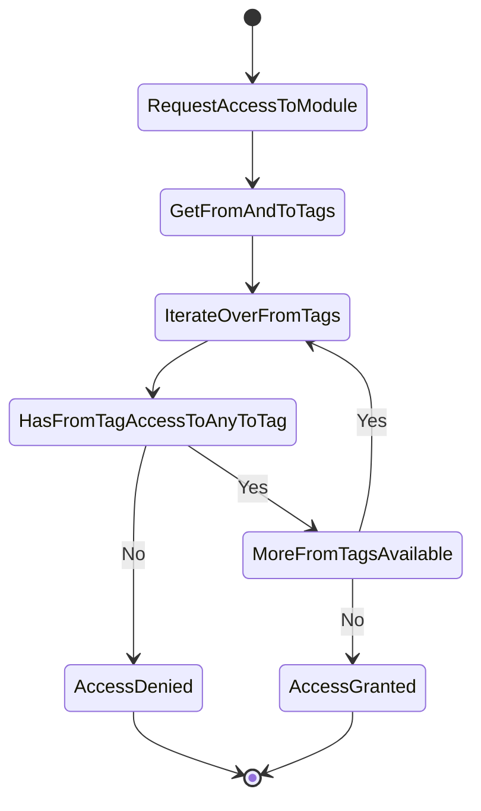
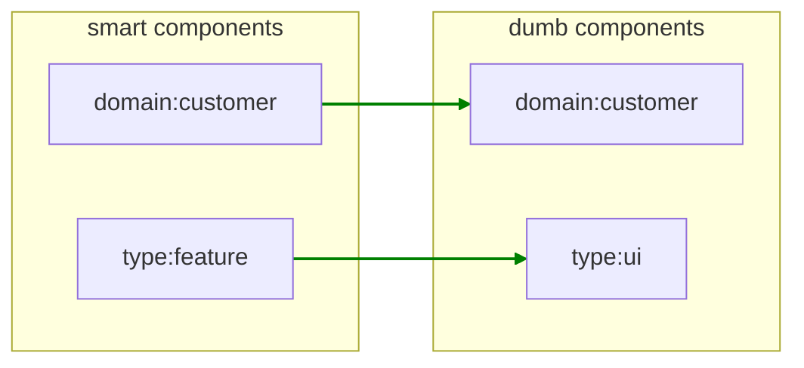
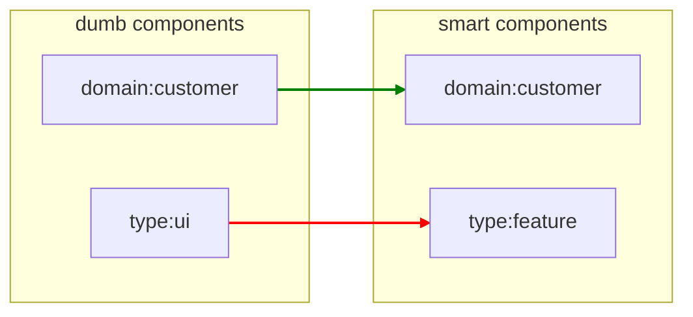
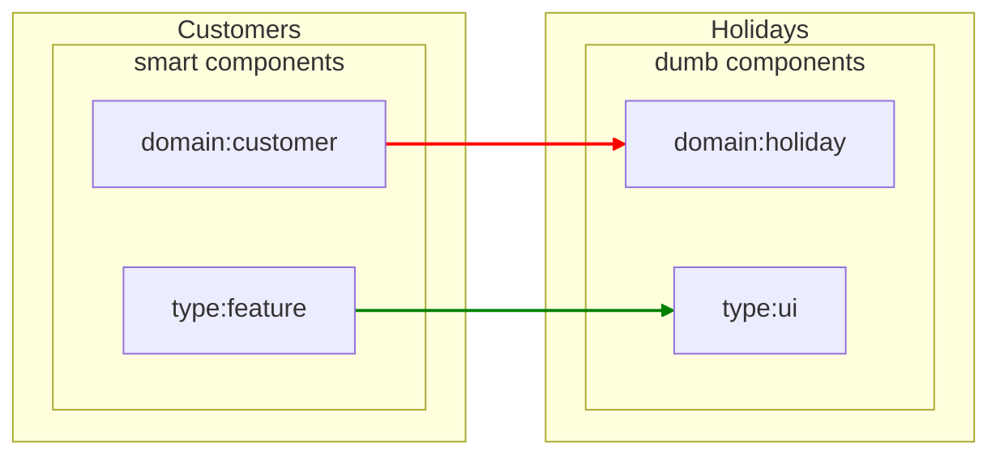
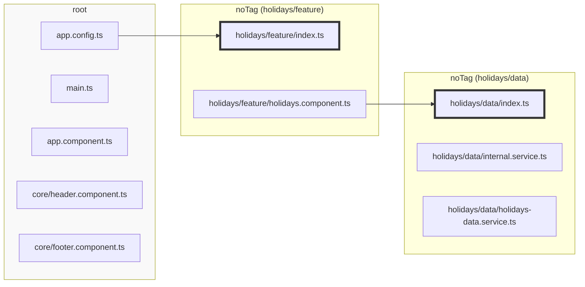

## Introduction

Dependency rules determine which modules can access other modules. Since managing dependencies on a per-module basis
doesn't scale well, Sheriff utilizes tags to group modules together. Dependency rules are then defined based on these
tags.

Each tag specifies a list of other tags it can access. To maintain clarity, it’s best practice to categorize tags into
two groups: one for defining the module's domain/scope and another for defining the module's type.

For instance, if an application includes a customer domain and a holiday domain, these would define the domain tags.

Within a domain, you might have different modules distinguished by type tags. For example, one module might contain
smart components, another might have dumb components, and another might handle logic.

Domain tags could be `domain:customer` and `domain:holiday`. Type tags could be `type:feature` (for smart components),
`type:ui` (for dumb components), or `type:data` (for logic).

Each module should have both a domain tag and a type tag. For example, a module containing smart components for
customers would be tagged with `domain:customer` and `type:feature`. A module in the same domain but containing UI
components would be tagged with `domain:customer` and `type:ui`.

Dependency rules specify that a module tagged with `domain:customer` can only access modules with the same domain tag.
Additionally, a module tagged with `type:feature` can access modules tagged with `type:ui` and `type:data`.

When a module containing smart components needs to access a dumb component, Sheriff retrieves the tags for both modules.
It then checks each tag of the smart component module to determine if it is permitted to access the corresponding tags
of the dumb component module.



Since both modules share the same domain, access is allowed based on the domain tag. Additionally, because "type:
feature" is allowed to access "type:ui", all tags are cleared, and access is granted.



Conversely, if a dumb component tries to access a smart component, access would be denied based on the type tag.



If a smart component from the customer domain tries to access a dumb component from another domain, access would be
denied due to the domain tag.



## Automatic Tagging

Initially, you don't need to assign tags to modules manually.

Any module that remains untagged is automatically assigned the `noTag` tag.

All files that are not part of a specific module are assigned to the `root` module and therefore receive the `root` tag.

However, it is essential to set up the dependency rules. Specifically, you must allow the [`root` tag](#the-root-tag) (
i.e., the root module) to access all other untagged modules.

This configuration is done by setting the `depRules` in the _sheriff.config.ts_ file. The `depRules` is an object
literal where each key represents the from tag and its value specifies the tags it can access.

Initially, all modules can access each other. As a result, every `noTag` module can access other `noTag` modules as well
as those tagged with `root`.

If you use the [CLI](./cli) to initialize Sheriff for the first time, this configuration will be set up automatically.

Here's an example configuration in _sheriff.config.ts_:

```typescript
import { SheriffConfig } from '@softarc/sheriff-core';

export const sheriffConfig: SheriffConfig = {
  depRules: {
    root: 'noTag',
    noTag: ['noTag', 'root'],
  },
};
```

This approach is recommended for existing projects, as it allows for the incremental introduction of Sheriff.

If you are starting a new project, you can skip this step and proceed directly to [manual tagging](#manual-tagging).

---

To disable automatic tagging, set `autoTagging` to `false`:

```typescript
import { SheriffConfig } from '@softarc/sheriff-core';

export const sheriffConfig: SheriffConfig = {
  autoTagging: false,
  tagging: {
    // see below...
  },
};
```

## The `root` Tag

Consider the following directory structure:

<pre>
src/app
├── main.ts
├── app.config.ts
├── app.component.ts
├── holidays
│   ├── data
│   │   ├── index.ts
│   │   ├── internal.service.ts
│   │   └── holidays-data.service.ts
│   ├── feature
│   │   ├── index.ts
│   │   └── holidays-facade.service.ts
│── core
│   ├── header.component.ts
│   ├── footer.component.ts
</pre>

The directories _src/app/holidays/data_ and _src/app/holidays/feature_ are considered modules. All other files are part
of the root module, which is automatically tagged with `root` by Sheriff. This tag cannot be changed, and the root
module does not include an _index.ts_ file. [By default](./integration), importing from the root module is not
permitted.



## Manual Tagging

To assign tags manually, you need to provide a `tagging` object in the _sheriff.config.ts_ file. The keys in this object
represent the module directories, and the corresponding values are the tags assigned to those modules.

The following snippet demonstrates a configuration where four directories are assigned both a domain and a module type:

```typescript
import { SheriffConfig } from '@softarc/sheriff-core';

export const sheriffConfig: SheriffConfig = {
  tagging: {
    'src/app/holidays/feature': ['domain:holidays', 'type:feature'],
    'src/app/holidays/data': ['domain:holidays', 'type:data'],
    'src/app/customers/feature': ['domain:customers', 'type:feature'],
    'src/app/customers/data': ['domain:customers', 'type:data'],
  },
  depRules: {},
};
```

By using `domain:_` and `type:_`, we establish two dimensions that allow us to define the following rules:

1. A module can only depend on other modules within the same domain.
2. A module tagged as `type:feature` can depend on `type:data`, but the reverse is not allowed.
3. The `root` module can depend on modules tagged as `type:feature`. Since the root module only has the `root` tag,
   there is no need to include domain tags.

```typescript
import { SheriffConfig } from '@softarc/sheriff-core';

export const sheriffConfig: SheriffConfig = {
  version: 1,
  tagging: {
    'src/app/holidays/feature': ['domain:holidays', 'type:feature'],
    'src/app/holidays/data': ['domain:holidays', 'type:data'],
    'src/app/customers/feature': ['domain:customers', 'type:feature'],
    'src/app/customers/data': ['domain:customers', 'type:data'],
  },
  depRules: {
    'domain:holidays': ['domain:holidays'], // Rule 1
    'domain:customers': ['domain:customers'], // Rule 1
    'type:feature': 'type:data', // Rule 2
    root: 'type:feature', // Rule 3
  },
};
```

If these rules are violated, a linting error will be triggered:

</img>

For existing projects, it is recommended to tag modules and define dependency rules incrementally.

If you prefer to only tag modules within the "holidays" directory and leave the rest of the modules auto-tagged, you can
do so:

```typescript
import { SheriffConfig } from '@softarc/sheriff-core';

export const sheriffConfig: SheriffConfig = {
  tagging: {
    'src/app/holidays/feature': ['domain:holidays', 'type:feature'],
    'src/app/holidays/data': ['domain:holidays', 'type:data'],
  },
  depRules: {
    'domain:holidays': ['domain:holidays', 'noTag'],
    'type:feature': ['type:data', 'noTag'],
    root: ['type:feature', 'noTag'],
    noTag: ['noTag', 'root'],
  },
};
```

All modules in the "customers" directory are assigned the `noTag` tag. Be aware that this setup allows any module from
`domain:holidays` to depend on modules within the "customers" directory, but the reverse is not permitted.

## Nested Paths

Nested paths simplify the configuration. Multiple levels are allowed.

```typescript
import { SheriffConfig } from '@softarc/sheriff-core';

export const sheriffConfig: SheriffConfig = {
  tagging: {
    'src/app': {
      holidays: {
        feature: ['domain:holidays', 'type:feature'],
        data: ['domain:holidays', 'type:data'],
      },
      customers: {
        feature: ['domain:customers', 'type:feature'],
        data: ['domain:customers', 'type:data'],
      },
    },
  },
  depRules: {
    'domain:holidays': ['domain:holidays'],
    'domain:customers': ['domain:customers'],
    'type:feature': 'type:data',
    root: ['type:feature'],
  },
};
```

## Placeholders

Placeholders help with repeating patterns. They have the snippet `<name>`.

```typescript
import { SheriffConfig } from '@softarc/sheriff-core';

export const sheriffConfig: SheriffConfig = {
  tagging: {
    'src/app': {
      holidays: {
        '<type>': ['domain:holidays', 'type:<type>'],
      },
      customers: {
        '<type>': ['domain:customers', 'type:<type>'],
      },
    },
  },
  depRules: {
    'domain:holidays': ['domain:holidays'],
    'domain:customers': ['domain:customers'],
    'type:feature': 'type:data',
    root: ['type:feature'],
  },
};
```

We can use placeholders on all levels. Our configuration is now more concise.

```typescript
import { SheriffConfig } from '@softarc/sheriff-core';

export const sheriffConfig: SheriffConfig = {
  tagging: {
    'src/app/<domain>/<type>': ['domain:<domain>', 'type:<type>'],
  },
  depRules: {
    'domain:holidays': ['domain:holidays'],
    'domain:customers': ['domain:customers'],
    'type:feature': 'type:data',
    root: ['type:feature'],
  },
};
```

## `depRules` Functions & Wildcards

We could use functions for `depRules` instead of static values. The names of the tags can include wildcards:

```typescript
import { SheriffConfig } from '@softarc/sheriff-core';

export const sheriffConfig: SheriffConfig = {
  version: 1,
  tagging: {
    'src/app/<domain>/<type>': ['domain:<domain>', 'type:<type>'],
  },
  depRules: {
    'domain:*': ({ from, to }) => from === to,
    'type:feature': 'type:data',
    root: ['type:feature'],
  },
};
```

or use `sameTag`, which is a pre-defined function.

```typescript
import { sameTag, SheriffConfig } from '@softarc/sheriff-core';

export const sheriffConfig: SheriffConfig = {
  version: 1,
  tagging: {
    'src/app/<domain>/<type>': ['domain:<domain>', 'type:<type>'],
  },
  depRules: {
    'domain:*': [sameTag, 'shared'],
    'type:feature': 'type:data',
    root: ['type:feature'],
  },
};
```
