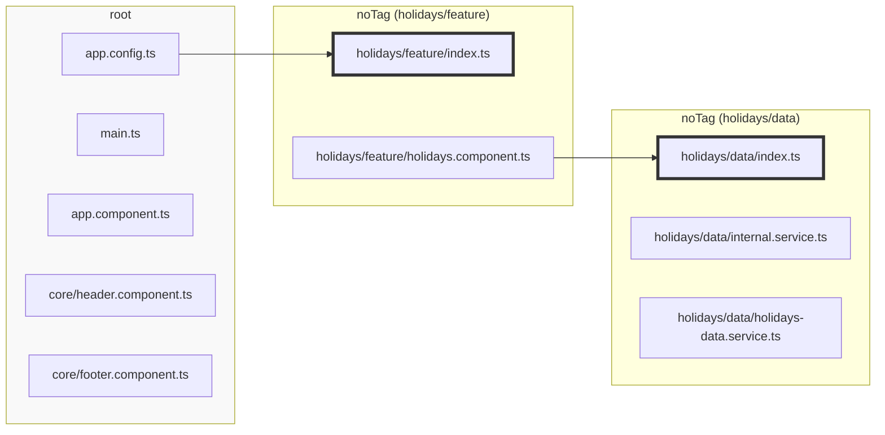

Sheriff provides access rules.

To define access rules, run `npx sheriff init` in your project's root folder. This creates a _sheriff.config.ts_ file, where you can define the tags and dependency rules.

The initial `sheriff.config.ts` doesn't have any restrictions in terms of dependency rules.

## Automatic Tagging

By default, an untagged module has the tag "noTag". All files which are not part of a module are
assigned to the "root" module and therefore have the tag "root".

Dependency rules operate on those tags.

Here's an example of a _sheriff.config.ts_ file with auto-tagged modules:

```typescript
import { SheriffConfig } from '@softarc/sheriff-core';

export const sheriffConfig: SheriffConfig = {
  depRules: {
    root: 'noTag',
    noTag: ['noTag', 'root'],
  },
};
```

The configuration allows every module with tag "noTag" to access any other module with tag "noTag"
and ["root"](#42-the-root-tag).

This is the recommendation for existing projects and allows an incremental introduction of Sheriff.

If you start from scratch, you should go with [manual tagging](#manual-tagging).

To disable automatic tagging, set `autoTagging` to `false`:

```typescript
import { SheriffConfig } from '@softarc/sheriff-core';

export const sheriffConfig: SheriffConfig = {
  autoTagging: false,
  tagging: {
    // see below...
  },
};
```

## The `root` Tag

Let's say we have the following directory structure:

<pre>
src/app
├── main.ts
├── app.config.ts
├── app.component.ts
├── holidays
│   ├── data
│   │   ├── index.ts
│   │   ├── internal.service.ts
│   │   └── holidays-data.service.ts
│   ├── feature
│   │   ├── index.ts
│   │   └── holidays-facade.service.ts
│── core
│   ├── header.component.ts
│   ├── footer.component.ts
</pre>

_src/app/holidays/data_ and _src/app/holidays/feature_ are modules. All other files are part of the root module which
is tagged with "root". Sheriff assigns the tag "root" automatically. You cannot change it and "root" doesn't have an
_index.ts_. [By default](./integration), it is not possible to import from the root module.



## Manual Tagging

The following snippet shows a configuration where four directories are assigned to a domain and to a module type:

```typescript
import { SheriffConfig } from '@softarc/sheriff-core';

export const sheriffConfig: SheriffConfig = {
  tagging: {
    'src/app/holidays/feature': ['domain:holidays', 'type:feature'],
    'src/app/holidays/data': ['domain:holidays', 'type:data'],
    'src/app/customers/feature': ['domain:customers', 'type:feature'],
    'src/app/customers/data': ['domain:customers', 'type:data'],
  },
  depRules: {},
};
```

With "domain:_" and "type:_", we have two dimensions which allows us to define the following rules:

1. A module can only depend on modules of the same domain
2. A module of "type:feature" can depend on "type:data" but not the other way around
3. "root" can depend on a module of "type:feature" and both domains.

```typescript
import { SheriffConfig } from '@softarc/sheriff-core';

export const sheriffConfig: SheriffConfig = {
  version: 1,
  tagging: {
    'src/app/holidays/feature': ['domain:holidays', 'type:feature'],
    'src/app/holidays/data': ['domain:holidays', 'type:data'],
    'src/app/customers/feature': ['domain:customers', 'type:feature'],
    'src/app/customers/data': ['domain:customers', 'type:data'],
  },
  depRules: {
    'domain:holidays': ['domain:holidays'], // Rule 1
    'domain:customers': ['domain:customers'], // Rule 1
    'type:feature': 'type:data', // Rule 2
    root: ['type:feature', 'domain:holidays', 'domain:customers'], // Rule 3
  },
};
```

If those roles are violated, a linting error is thrown:

</img>

For existing projects, you want to tag modules and define dependency rules incrementally.

If you only want to tag modules from "holidays" and leave the rest auto-tagged, you can do so:

```typescript
import { SheriffConfig } from '@softarc/sheriff-core';

export const sheriffConfig: SheriffConfig = {
  tagging: {
    'src/app/holidays/feature': ['domain:holidays', 'type:feature'],
    'src/app/holidays/data': ['domain:holidays', 'type:data'],
  },
  depRules: {
    'domain:holidays': ['domain:holidays', 'noTag'],
    'type:feature': ['type:data', 'noTag'],
    root: ['type:feature', 'domain:holidays', 'noTag'],
    noTag: ['noTag', 'root'],
  },
};
```

All modules in the directory "customers" have the tag "noTag". Be aware, that every module from "domain:holidays" can
now depend on any module from directory "customers" but not vice versa.

## Nested Paths

Nested paths simplify the configuration. Multiple levels are allowed.

```typescript
import { SheriffConfig } from '@softarc/sheriff-core';

export const sheriffConfig: SheriffConfig = {
  tagging: {
    'src/app': {
      holidays: {
        feature: ['domain:holidays', 'type:feature'],
        data: ['domain:holidays', 'type:data'],
      },
      customers: {
        feature: ['domain:customers', 'type:feature'],
        data: ['domain:customers', 'type:data'],
      },
    },
  },
  depRules: {
    'domain:holidays': ['domain:holidays'],
    'domain:customers': ['domain:customers'],
    'type:feature': 'type:data',
    root: ['type:feature', 'domain:holidays', 'domain:customers'],
  },
};
```

## Placeholders

Placeholders help with repeating patterns. They have the snippet `<name>`.

```typescript
import { SheriffConfig } from '@softarc/sheriff-core';

export const sheriffConfig: SheriffConfig = {
  tagging: {
    'src/app': {
      holidays: {
        '<type>': ['domain:holidays', 'type:<type>'],
      },
      customers: {
        '<type>': ['domain:customers', 'type:<type>'],
      },
    },
  },
  depRules: {
    'domain:holidays': ['domain:holidays'],
    'domain:customers': ['domain:customers'],
    'type:feature': 'type:data',
    root: ['type:feature', 'domain:holidays', 'domain:customers'],
  },
};
```

We can use placeholders on all levels. Our configuration is now more concise.

```typescript
import { SheriffConfig } from '@softarc/sheriff-core';

export const sheriffConfig: SheriffConfig = {
  version: 1,
  tagging: {
    'src/app/<domain>/<type>': ['domain:<domain>', 'type:<type>'],
  },
  depRules: {
    'domain:holidays': ['domain:holidays'],
    'domain:customers': ['domain:customers'],
    'type:feature': 'type:data',
    root: ['type:feature', 'domain:holidays', 'domain:customers'],
  },
};
```

## `depRules` Functions & Wildcards

We could use functions for `depRules` instead of static values. The names of the tags can include wildcards:

```typescript
import { SheriffConfig } from '@softarc/sheriff-core';

export const sheriffConfig: SheriffConfig = {
  version: 1,
  tagging: {
    'src/app/<domain>/<type>': ['domain:<domain>', 'type:<type>'],
  },
  depRules: {
    'domain:*': ({ from, to }) => from === to,
    'type:feature': 'type:data',
    root: ['type:feature', ({ to }) => to.startsWith('domain:')],
  },
};
```

or

```typescript
import { sameTag, SheriffConfig } from '@softarc/sheriff-core';

export const sheriffConfig: SheriffConfig = {
  version: 1,
  tagging: {
    'src/app/<domain>/<type>': ['domain:<domain>', 'type:<type>'],
  },
  depRules: {
    'domain:*': [sameTag, 'shared'],
    'type:feature': 'type:data',
    root: ['type:feature', ({ to }) => to.startsWith('domain:')],
  },
};
```
