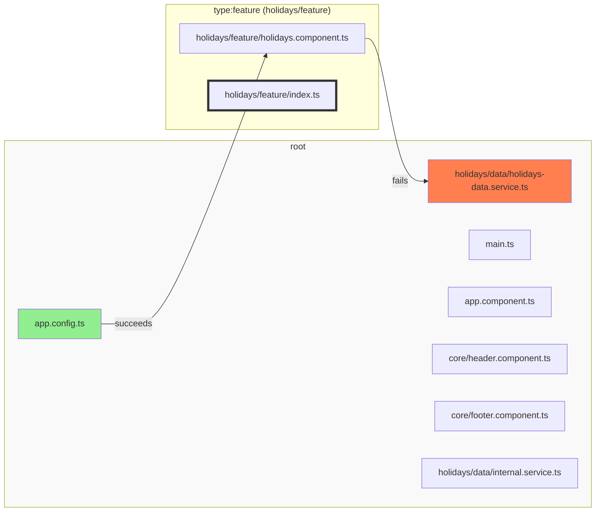
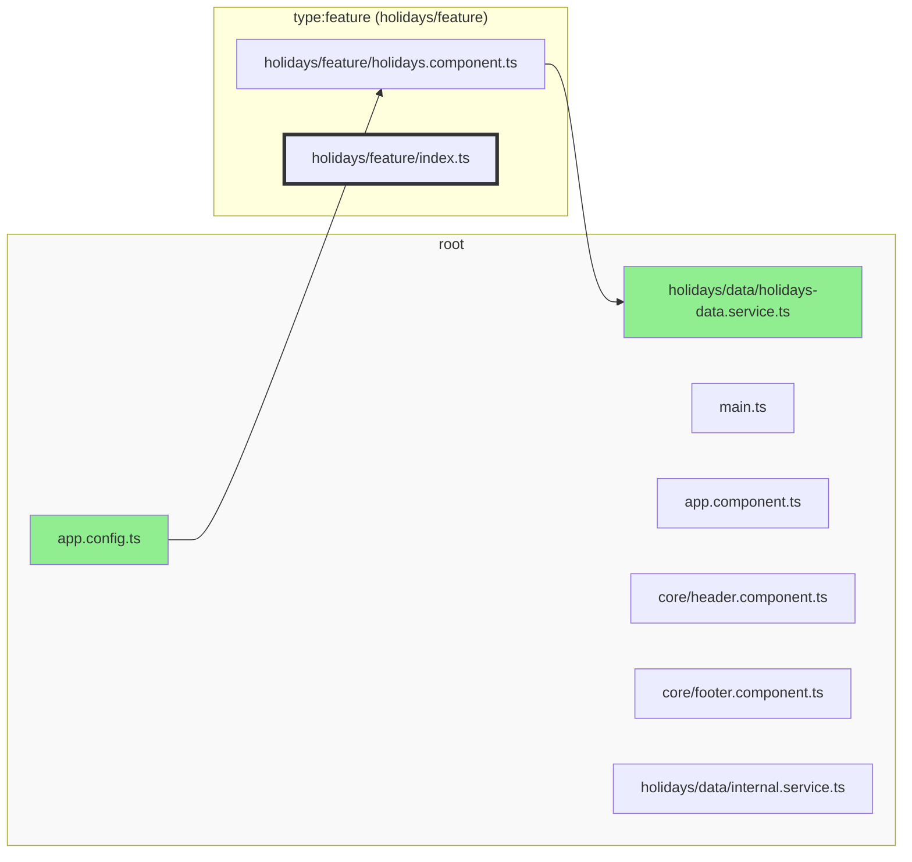

It is usually not possible to modularize an existing codebase at once. Instead, we have to integrate Sheriff
incrementally.

Next to [automatic tagging](./dependency-rules#automatic-tagging), we introduce modules step by step.

## With barrel-less modules

The recommended approach is start with only one module. For example `holidays/feature`. Encapsulated files of that modules need to be moved to the `internals` folder. If `holidays/feature` is barrel-less, it can access `root`, given the dependency rules allow access to tag `root`.

By default, barrel-less modules are disabled. They have to be enabled in `sheriff.config.ts` via `enableBarrelLess: true`.

## Without barrel-less modules

If Sheriff only supports barrel modules, then the integration would still progress module by module. `holidays/feature` gets an `index.ts` and defines its exposed files. Since `root` would be barrel-less, `holidays/feature` cannot access it.



There is a special property for this use case: `excludeRoot`. Once set to `true`, all modules can access all files in the root module.

```typescript
export const config: SheriffConfig = {
  excludeRoot: true, // <-- set this
  modules: {
    'src/shared': 'shared',
  },
  depRules: {
    root: 'noTag',
    noTag: ['noTag', 'root'],
    shared: anyTag,
  },
};
```



---

Please note that the `excludeRoot` property only makes sense with `enableBarrelLess: false`.
