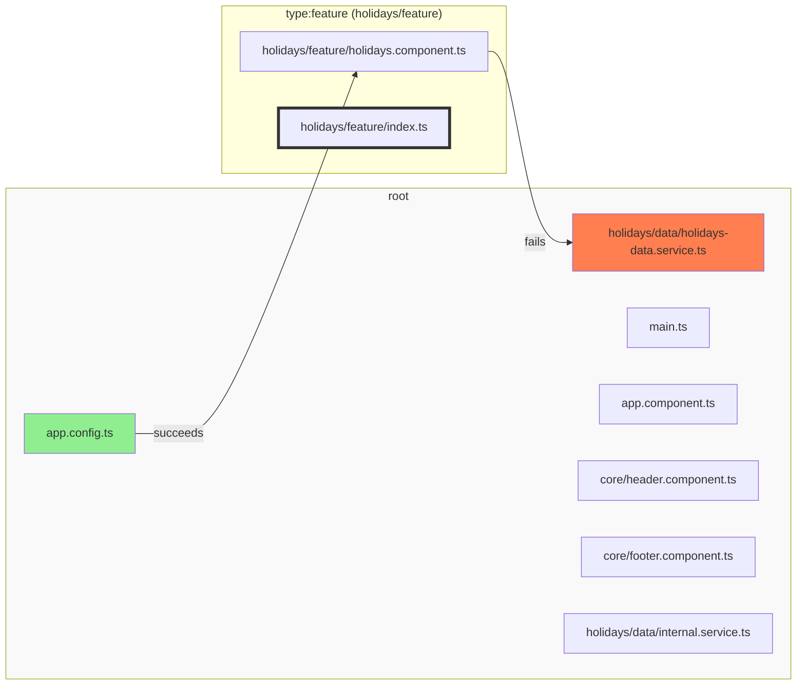
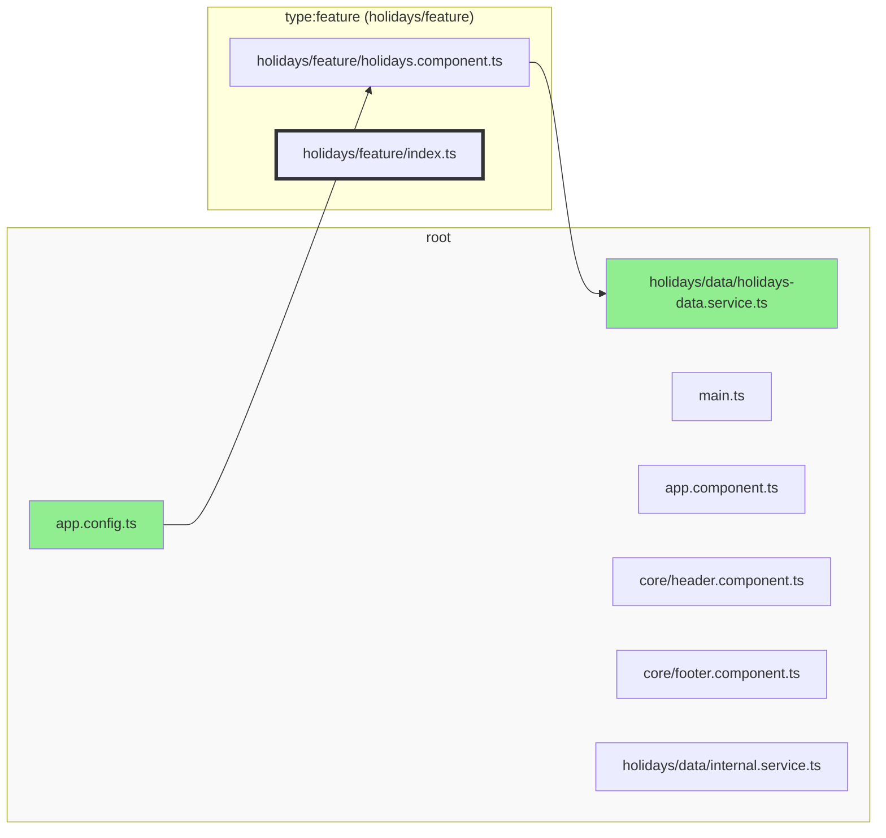

It is usually not possible to modularize an existing codebase at once. Instead, we have to integrate Sheriff
incrementally.

Next to [automatic tagging](./dependency-rules#automatic-tagging), we introduce manual tagged modules step by step.

The recommended approach is start with only one module. For example _holidays/feature_. All files from the outside have
to import from the module's _index.ts_, and it has the tags "type:feature".

It is very likely that _holidays/feature_ depends on files in the "root" module. Since "root" doesn't have
an **index.ts**, no other module can depend on it:



We can disable the deep import checks for the **root** module by setting `excludeRoot` in _sheriff.config.ts_ to `true`:

```typescript
export const config: SheriffConfig = {
  excludeRoot: true, // <-- set this
  tagging: {
    'src/shared': 'shared',
  },
  depRules: {
    root: 'noTag',
    noTag: ['noTag', 'root'],
    shared: anyTag,
  },
};
```



Once all files from "root" import form **shared's** _index.ts_, create another module and do the same.
