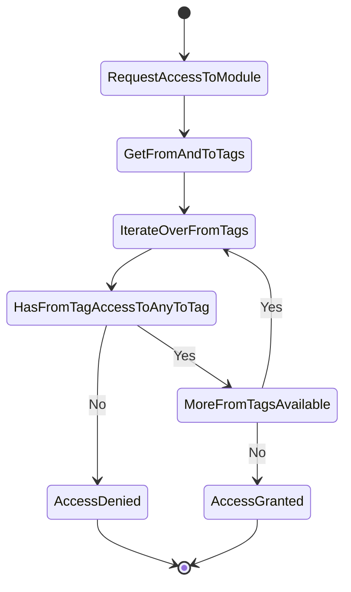

## Version 0.17

The algorithm for dependency rules has been updated, which may introduce breaking changes.

When a module attempts to access another module, the following steps are executed to determine if the access is allowed:

- Sheriff retrieves the tags for both modules.
- For each tag in the "from" module, Sheriff checks if it has clearance to access the corresponding tag in the "to" module.

For more information, see the [dependency rules documentation](../dependency-rules).

:::note

It is very likely that most applications will not be affected by this change. However, if you encounter issues, please file a bug report.

:::
